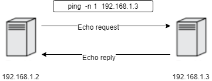
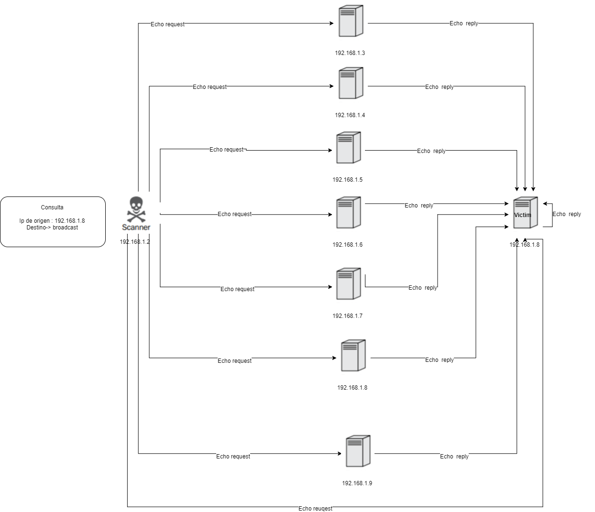
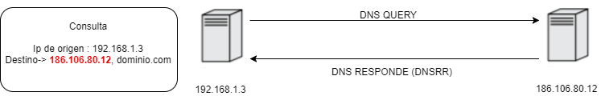
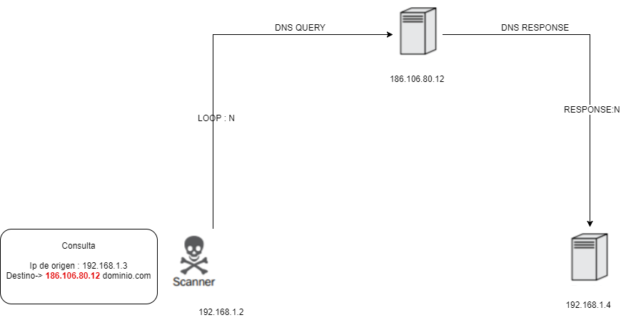
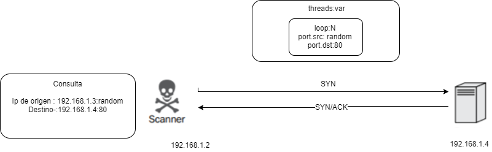
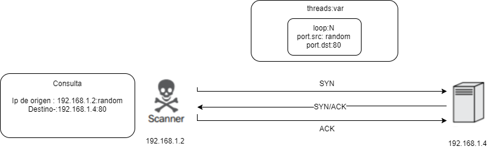

# Denial service #


 Los ataques DoS de amplificación de tráfico son capaces de generar una condición DoS al consumir el
 Ancho de banda de red que está disponible para un servidor, dispositivo o red en particular. Dos condiciones 
 Son necesarios para que un ataque de amplificación de tráfico tenga éxito. Estas condiciones son las siguientes:
 
 *Redirección*: Un atacante debe poder solicitar una respuesta que pueda ser redirigida a una Víctima. 
   Esto generalmente se logra mediante la suplantación de identidad IP. Como UDP no es un Protocolo orientado a conexión,
   a mayoría de los protocolos de capa de aplicación que usan UDP como
   Protocolo de capa de transporte se puede utilizar para redirigir las respuestas de servicio a otros Peticiones falsas.

 *Amplificación*: La respuesta redireccionada debe ser de mayor tamaño que la solicitud que inicial
   Cuanto mayor sea el tamaño en bytes de la respuesta, más exito el ataque será.
   
   
 # Protocolo UDP #
   
   El protcolo UDP no es un protocolo orientado a la conexion, aqui nace el primer problema
   
  "Toda implementación TCP/IP que no se use exclusivamente para ruteo incluye UDP"
  "UDP no otorga garantías para la entrega de sus mensajes (por lo que realmente no se debería encontrar en la capa 4)"
   
   Por lo tan to UDP, no necesita establecer un conexion a priori para el intercambio de paquetes, por ende, este no sanitiza  ni          comprueba el origen y confiabilidad del emisor, lo que lo hace totalmente vulnerable a suplantacion de identidad.
   
   gracias  a lo anterior es posible realizar los siguiente ataques, que resultaran en una denegacion de servicio, siendo capaz de       
   rediriguir trafico a una maquina especifica.
   
   
 # ftp_fuzzy.py #
   
   En general, los desbordamientos de búfer son capaces de causar una denegación de servicio, porque
   Pueden dar lugar a que se carguen datos arbitrarios en segmentos de memoria no deseados. Esta
   Puede interrumpir el flujo de ejecución y resultar en un bloqueo del servicio o del sistema operativo.
   
   ftp_fuzzy.py solo intenta encontrar un desbordamiento de buffer en algun comando usado en consola, ingresando un payload
   cabe destacar que la conexion al ftp,  en este es script se hace de forma remota con ayuda de la libreria socket
   
   
 # Dos_icmp.py #
    
  Cuando hacemos un ping hacia una maquina, lo que en realidad sucede, es que enviamos una solicitud echo request, por lo tanto 
  si la maquina objetivo se encuentra activa, y libre de algun firewall, deberia responde con un echo reply
    
    
   
    
    
  **Ddos con respuestas tipo echo reply**
    
   
  
  
  
 # Dos_dns.py #
 
 La denegacion de servicio por medio de peticiones al servidor DNS, cumple con las dos condicione necesarias para que el ataque se lleve   a cabo.
 
  * Primero, trabaja con el protocolo UDP, por lo tanto podremos spoofear la ip de origen
  * Segunfo, la respuesta en bytes es mucho mas grande, que la peticiones realizada
  
  La peticion para averiguar los diferentes registro DNS asociados a un dominio o IP, suelen responder con registros de direccion,         registro de dirección IPv6,Registro de servidor de nombres, registros de punteros entre otros.
  
  Lo que reprentaria en bytes un tamaño mayor a la solicitud enviada, si logramos redireccionar esa respuesta a un equipo especifico y     ademas lo hacemos indefinidamente, es muy probable que el sistema sufra fallos, a causa del trafico entrante
  
  
  
  
 **Ddos con respuestas DNSRR**
   
  
  
  
  # Dos_syn.py #
  
  Este tipo de denegacion de servicio aprovecha la posibilidad de crear una conexion a un puerto TCP, realizando a medias el 3 way         handshake, lo interesante sucede cuando enviamos la solicitud de conexion SYN y nuestro target responde con SYN/ACK, en este punto       nuestro objetivo revela que esta dispuesto a establecer una conexion con nosotros.
  
  Gracias a esto ya podemos generar una inundacion de paquetes SYN, donde la IP de origen sera la nuestra y nuestro puerto un valor       random entre 0 y 65535, la direccion IP de destino, sera la de nuestro target  y su puerto el 80
  
  ¿Por que el 80?
  
  Porque usualmente aqui encontramos corriendo el servicio de apache y si nuestro ataque es exitoso, entonces denegaremos su servicio
  
  Los servicios que corren en TCP solo permiten un cantidad limitada de half-open o medio abiertas, por lo tanto despues  de haber         superado este limite, el servidor ya no podra recibir nuevas conexiones 
  
 
 
 
 
 # SOCKET_stress.py #
 
  Este tipo de denegacion de servicio es similar  a la inundacion de paquetes de sincronizacon SYN, pero a diferencia de ese, en este     tipo de ataque, completaremos con la trama final ACK, y podemos generar un estado de conexion ESTABLISHED.
 
  El punto critico de este ataque, cuando enviamos e paquete ACK de confirmacion, enviamos el parametro windows=0 por lo tanto los         servicios vulnerables no transmitirán ningún dato en respuesta a la conexión, Debido a la indicación de cualquier ventana vacía por     parte del cliente de conexión.
 
  En lugar, el servidor mantendrá los datos a transmitir en la memoria. Inundando un servidor con estos, las conexiones established       agotarán los recursos del servidor, entre estos la memoria, el espacio de intercambio,Y potencia de procesamiento.

  Al ejecutar este script, es posible ejecutar el comando, 

   ```
    netstat -noa & grep ESTABLISHED 
   ```

  Asi podremos confirmar, que  hemos establecido una conexion con el target, de igual forma sucede si lo ejecutamos en el target
 
  para poder llevar a cabo este ataque utilizando al libreria scapy, es necesario desactivar en el sistema, las respuestas tipo RST, 
  ya que al enviar el paquete SYN,  y nuestra target responda con SYN/ACk, nuestro sistema respondera con un paquete RST/ACK
 
  Esto se debe a la naturaleza de el protocolo TCP, si una maquina envia un paquete ACK a otra, esta respondera con RST, ya que en         ningun   momento ella, como sistema, envio un paquete de sincronizacion.
 
  En nuestro caso, lo hicieron pero con ayuda de scapy, por lo tanto al bloquear las respuestas RST de nuestra maquina, podremos           responder con el paquete ACK y establecer la conexion.
 
  
  
  
  Con ayuda del comando:
  
    ```
     free -m
    ```
  
  Podremos ver el estado de la memoria, en la cual podremos ver luego de iniciado el ataque, como varian los recursos, al momento que     los recursos ya no pueda soportar el trafico esta empezara a fallar.
  
  
  
  
  
   
 
 
    
  
   
