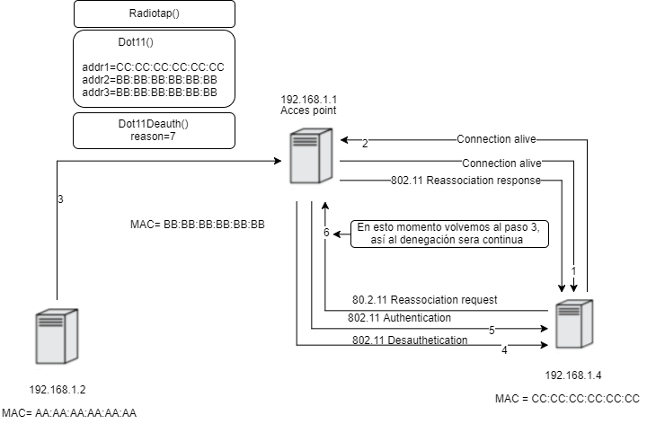

# DESAUTENTICADOR DE RED #

Este tipo de ataque se encuentra en el rango de Dos, ya que es posible denegar el servicio a multiples dispositivos

**Datos a tener en cuenta**
 * Para que el script funcione correctamente, la tarjeta de red debe encontrarse en modo monitor
 * La interfaz de red debe encontrarse en el mismo canal del access point
 
 Para arreglarlo  usamos la suite de aircrack-ng
  1. Ponemos la  tarjeta en modo monitor
   ``` 
    airmon-ng start wlan0
   ```
   
  2. vemos los access point cercanos 
   ```
    airodump-ng mon0
   ```
  3. ya teniendo lo anterior, vemos porque canal se encuentrar trasnmitiendo nuestro access point target
  
  4. Iniciamos una nueva interfaz que se comunique por ese mismo canal
   ```
    airmon-ng start mon0 <canal>
   ```
  5.Ya podemos correr el script
  
  
  
  **Diagrama de ataque**
  
   
  

