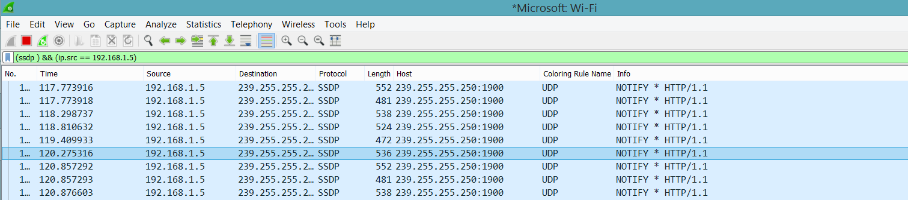
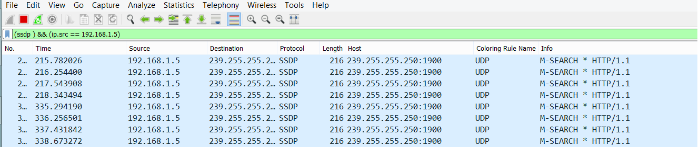

# Usando miranda para detectar S.0 #

Miranda es una herramienta de administración de UPnP escrita en Python.

# Pero primero ¿Que es UPnP ? #

UPnP (Universal Plug-N-Play) es un protocolo que permite que varios dispositivos de red se autoconfiguren por si mismos. 

En pocas palabras este protocolo es capaz de autoconfigurar los puertos de un dispositivo que soporte UPnP para evitar la tediosa tarea de abrir y cerrar puertos
para la correcta utilizacion de un sofware

Usualmente lo utilizamos en la consola de videojuegos, cuando intentamos conectar el chat de voz y video.
Sony por ejemplo utiliza  el puerto TCP 80, 443, 3478, 3479, 3480, 8080 y UDP  3478, 3479 entre otros

Por lo tanto Sony nos recomienda que si nuestro router soporta UPnp lo usemos, ya que este configurara automaticamente la apertura de estos puertos

# Funcionamient de UPnp #

Los router que soporta UPnp utilizan dirección multicast (multidifusión) 239.255.255.250 y el puerto TCP 1900 para comunicar a otros dispotivos que ofrece el servicio UPnp
esto lo hace mediante una peticion SSDP NOTIFIY, la cual se envia periodicamente y en caso de que un dispisitivo en la redes quisiera tomar el servicio enviaria una peticion SSDP RESPONDE

Tambien cuando nuestro dispositivo quiere encontrar a otro dispositivo que soporte UPnp, este lo hace enviando una peticion SSDP MSEARCH 

# ¿Como detecto el sistemas opetativo mediante UPnp? #

Dado a que nuestro sistemas emite estas comunicaciones automaticamente de forma multicast por el puerto 1900
podemos interceptar estas peticiones y analizarlas, para eso usaremos miranda

# Descubriendo hosts UPnP con Miranda # 

Primero ejecutamos en nuestra shell, el comando miranda el cual nos brindara un shell interactiva

 Para descubrir los host, utilizamos el comando pcap, o msearch

  * Cuando es ejecutado el comando ‘pcap’, Miranda se pondrá en escucha (modo pasivo) buscando mensajes SSDP NOTIFY.
  * Cuando es ejecutado el comando ‘msearch’ consultará los dispositivos UPnP usando un mensaje M-SEARCH. Por defecto, ‘msearch’ buscará todos los dispositivos UPnP.

Como podemos ver aquellos dispositivos compatibles con UPnp se encuentran emitienco peticiones MSEARCH o NOTIFY y gracias a esto, tenemos un indicio del S.0 que utiliza.

Si preguntan ese link que se encuentra en medio de las peticiones a que sitio redirige, Es UPnP utilizando SOAP el cual usa XML para estructurar la información enviada entre las dos partes. Las peticiones SOAP son esencialmente peticiones HTTP POST con alguna cabecera SOAP adicional incluida en las cabeceras HTTP, la cual trae consigolas configuraciones y dispositivos soportados, esta informacion viaja junto a los paquetes msearch y notify con el que podremos obtener mucha mas informacion acerca de nuestro objetivo, pero por lo que esta face concierne, solo la utilizamos para intentar descubrir el tipo y version de sistemas operativo de nuestra victima

"UPnP se encuentra activo en una vasta mayoría de redes caseras, e incluso también en algunas redes corporativas.Muchos dispositivos soportan UPnP en orden de facilitar el uso para los consumidores, sin embargo, a menudo soportan acciones que ningún servicio debería de estar posibilitado de ejecutar automáticamente, y especialmente sin ninguna autorización."

# Otros riesgos #

Dado a que por medio de UPnp se es posible modificar la apertura o cierro de los puertos en el router, es posible que un atancante, consiga redireccionar los puerto, lo que significaria un MITM o hacer publico el panel de administracion del router y porque no, backdorizar el sistema.

¿Pero se es necesario estar incluido en la red local para hacer el ataque?

La respuesta es NO, dado a que es  un protocolo que normalmente solo funciona dentro de una red local, lo que forzaria al atacante a infiltrase a la red local, para explotar las vulnerabilidades

Pero ya hace muchot tiempo PDP mostró que era posible usar Flash para enviar peticiones UPnP desde dentro del navegador de un cliente a un router con UPnP habilitado y cambiar la configuración del firewall de este. 

Dado que el archivo Flash puede ser embebido dentro de una página maliciosa, o inyectada dentro de una página confiable via XSS o SQL Injection, un atacante podría usar esto para remotamente alterar la configuración del router. 

Aqui su pagina: http://www.gnucitizen.org/blog/hacking-the-interwebs
