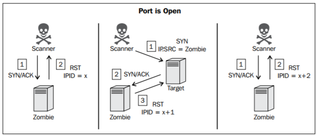
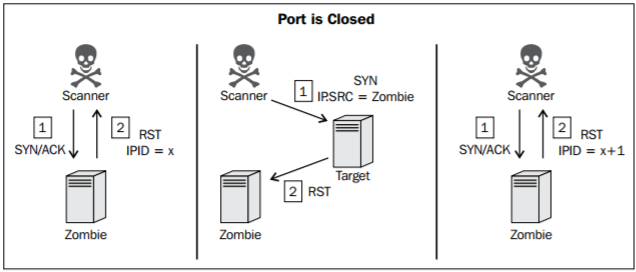

# Escaneo zombie #

Nuestro primer objetivo es encontrar un host con un ID incremental, el cual es un valor de el paquete IP
 
Nuestro segundo ojetivo es comparar este valor respeto a un antes y despues del scaneo

# Puerto abierto #

 
   
# Puerto Cerrado #

