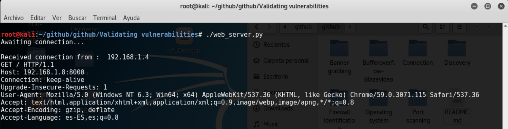
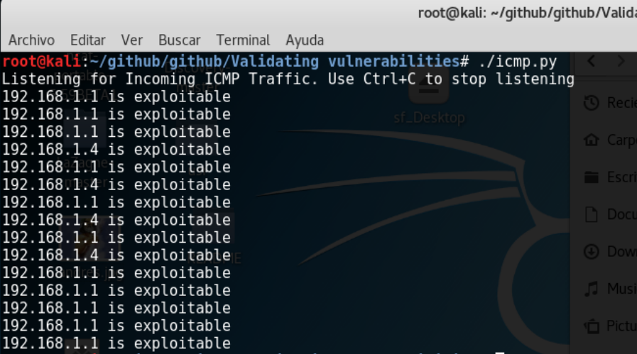

# Validando remote command execution (BLIND) #

Algunas veces solo queremos comprobar que nuestro target es vulnerable sin necesidad de ser totalmente intrusivos, para eso tenemos los siguiente scripts

#  web_server.py #

 Este script es simple, lo unico que hace es levantar un servidor web, esperando a que algun usuario conecte
 Este se pone a la escucha en el pueto 8000 y con la ip 0.0.0.0 es decir que podran conectar por todas las interfaces a la que el equipo este asociado
 
 
 ¿ Como compruebo que mi target es vulnerable con web_server.py ?
 
 Muchas veces encontramos paginas web con errores de  ejecucion de comandos remoto, sin embargo se nos hace dificil comprobar que el comando que introducimos
 se ejecuto exitosamente el la maquina donde se encuentra nuestro target, podria intentar  inyectar un shell y efectivamente comprobar que es vulnerable, pero ese 
 no es nuestro objetivo, ya que implicaria un moviento demasiado intrusivo, lo que probablemente alertaria a algun sistema de seguridad perimetral y seriamos bloqueados
 
 Por eso, si durante una prueba de intrusion queremos comprobar que nuestro  target es vulnerable, simplemente, podriamos lanzar un comando
 wget, curl, bitsadmin en windows, o start, ya el comando a usar se limita a disponibilidad en el sofware o las preferencias del atacante
 
 
 
 
 
 Despues de haber inyectado el comando, confirmamos en nuestro servidor y efectivamente la solicitud fue ella
 est quiere decir que la inyeccion fue realizada exito, ademas nos brinda un poco de informacion sobre la version del navegador
 en el campo user-agent
 
 
 # icmp.py #
 
 Como lo explicamos anteriormente,  comprobar que nuestro target es vulnerable siempre es un objetivo y si deseamos no generar tanto trafico
 esta es otra forma de comprobarlo
 
 despues de ubicar el campo que creemos es vulnerable, inyectamos un comando ping hacia nuestra maquina,
 
 para esto tenemos nuestro script, el cual hace un sniff sobre los paquetes ICMP, buscando aquellos en los que el campo. ip.dst coincida con nuestra IP
 esto comprobara que el ping inyectado a nuestro objetivo fue exitoso y nuestro script lo detecto, por lo tanto nuestro target se encuentra vulnerable 
 
 
 
 
 la salida nos muestra las IP de las maquina que se encuentran enviando paquetes ICMP
 
 ¿  192.168.1.1 por que aparece en nuestro output ?
  
  Ese es nuestro router comprobando que nuestro equipo se encuentre vivo, para continuar brindandonos serivico como DHCP, DNS entre otros
 
 por lo tanto con un par de pruebas y generando un patron simple lograremos identificar  cual es la IP perteneciente 
 a nuestro target
 
 
 
 
 
